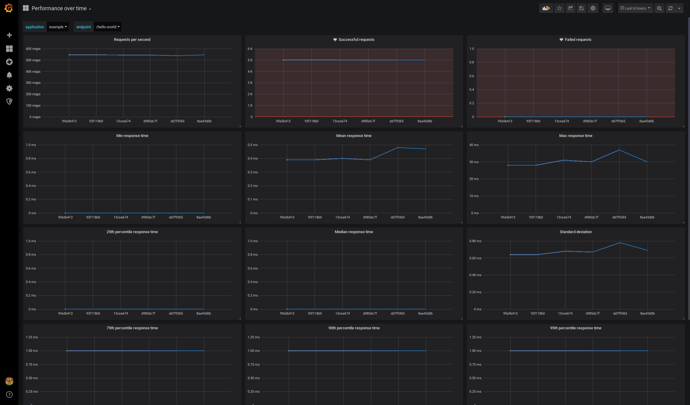
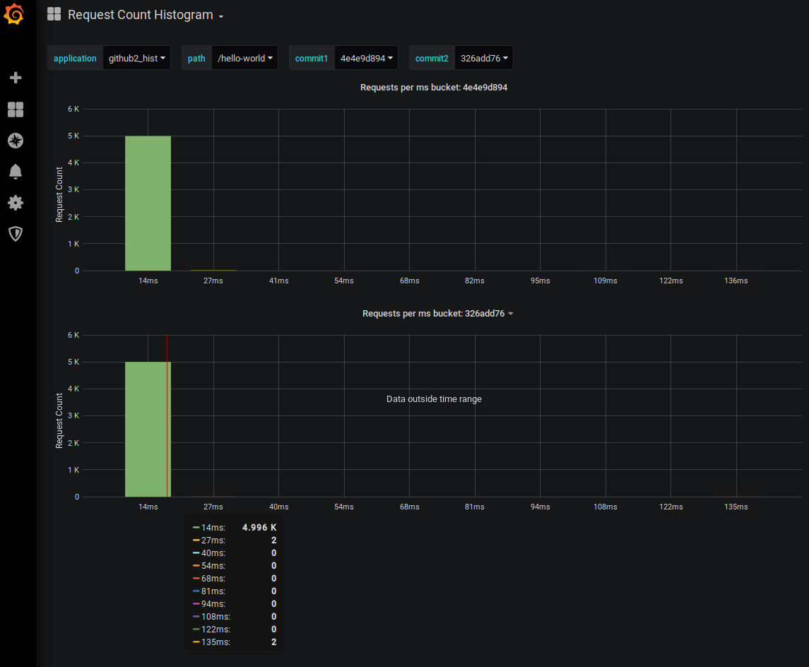

Quickstart
==========

* ``make build``
* ``make up``
* ``make install-jmeter``
* ``make test-example-app`` (this requires a service running on http://localhost:8080 such as dropwizard-example_)
* ``make parse COMMIT=<hash>``
* Browse to http://localhost:3000 and login with admin/admin

.. _dropwizard-example: https://github.com/dropwizard/dropwizard/tree/master/dropwizard-example
